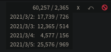
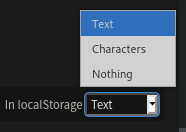

# Texthooker

[You can view the texthooker here](https://marcopolo-pastonmolo.github.io/texthooker/texthooker.html)

## Features
* Save text even after refresh.
* Undo (undo button or Ctrl + z)
* Daily and total stats (click counter)   
    
* Switch between saving text, saving only stats, and saving nothing   
    
